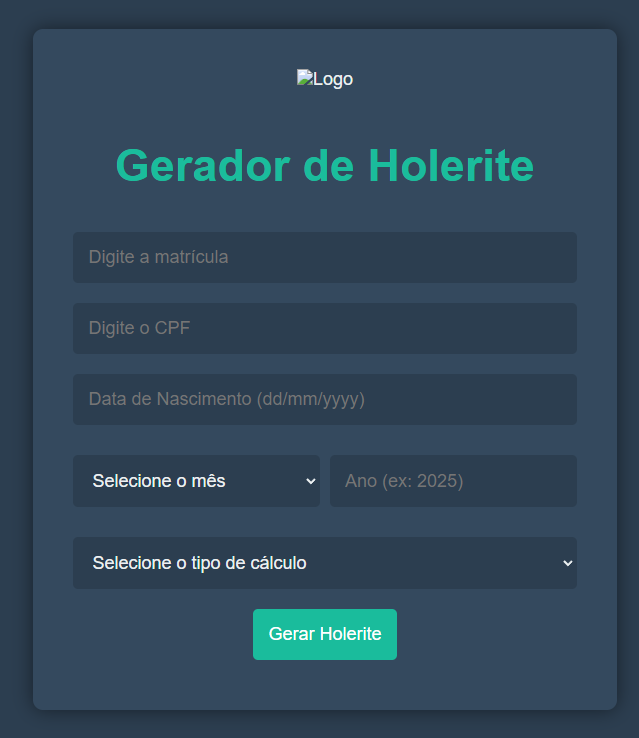

# Sistema de Geração de Holerite

Sistema Python co interface web para conectar ao banco de dados Oracle, executar consulta SQL e gerar PDF de holerite com formatação profissional do sistema HCM da Senior Sistemas. Modelo do holerite impresso se encontra no arquivo Modelo_holerite.pdf

## Tela do aplicativo


## Características

- **Interface Web:** Aplicação Flask com design moderno e intuitivo para fácil geração de holerites.
- Conexão segura com banco Oracle usando a biblioteca `oracledb`
- Execução de consulta SQL personalizada
- Geração de PDF formatado com layout profissional
- Suporte a múltiplos funcionários em um único relatório
- Cálculo automático de totais (proventos, descontos, líquido)
- Formatação monetária brasileira (R$)

## Arquivos do Sistema

### Arquivos Principais
- `app.py` - Aplicação web Flask.
- `holerite_system.py` - Classe principal do sistema de geração de holerite.
- `run_holerite.py` - Script de linha de comando para execução (legado).
- `requirements.txt` - Dependências do projeto.

### Arquivos de Entrada
- `holerite.sql` - Consulta SQL para buscar dados do holerite

## Pré-requisitos

### Software Necessário
- Python 3.7 ou superior
- Acesso a um banco de dados Oracle
- Bibliotecas Python (instaladas automaticamente):
  - `oracledb` - Conexão com Oracle
  - `reportlab` - Geração de PDF
  - `Flask` - Iterface web
  - `python-dotenv` - Leitura do arquivo .env
  - `gunicorn` - WSGI HTTP Serve
  - `waitress` - Executar o sistema em ambiente de produção
  - `bcrypt` - Criptografia da senha

### Configuração do Ambiente

1. **Instalar dependências:**
```bash
pip install -r requirements.txt
```

2. **Configurar acesso ao Oracle:**
   - Configure o arquivo .env
   - Certifique-se de que o servidor Oracle está acessível
   - Tenha as credenciais de acesso (usuário, senha, host, porta, service_name)

### Como Usar

1. **Criar campo**
```
Crie o campo "USU_SENHA" no banco de dados como varchar(60) via CBDS

```

2. **Edite o arquivo `.env`:**
```
host = seu_servidor_oracle.com  # IP ou hostname do Oracle
port: 1521                      # Porta do Oracle
service_name : 'ORCL'           # Nome do serviço
user = 'seu_usuario'            # Usuário do banco
password = 'sua_senha'          # Senha

```

3. **No terminal navegue até o diretório e execute:**
```
python app.py 
ou 
waitress-serve --host 192.168.1.20 --port 5000 app:app(para ambiente de produção)

```

4. **Dicas:**
```
No primeiro acesso o usuário entra com o matricula, cpf e data de nascimento, será solicitado para criar uma senha. A partir do segundo acesso será permitido gerar o holerite e será usado a senha no lugar da data de nascimento

```


## Estrutura da Consulta SQL

O arquivo `holerite.sql` deve retornar as seguintes colunas:

- `RAZSOC` - Razão Social da empresa
- `DATADM` - Data de admissão
- `NUMCAD` - Número do cadastro/matrícula
- `NOME` - Nome do funcionário
- `NUMCPF` - CPF do funcionário
- `CODEVE` - Código do evento
- `DESEVE` - Descrição do evento
- `TIPEVE` - Tipo do evento (1=Provento, 2=Provento, 3=Desconto, 4=Outros, 5=Outros Env.Provento, 6=Outros Env.Desconto)
- `REFERÊNCIA` - Referência do evento
- `VLRREAL` - Valor real usado para calculo do valor liquido 
- `VLRIMP` - Valor para impressão
- `TIPCAL` - Tipo de cálculo (11=Folha, 91=Adiantamento, 31=Decimo terceiro adiantamento, 32=Decimo terceiro integral)
- `PERREF` - Período de referência
- `CODAGE` - Código da Agência
- `CONBAN` - Código da Conta Bancária
- `DIGBAN` - Dígito da Conta Bancária
- `LOCAL` - Local de trabalho
- `CARGO` - Cargo do empregado
- `SALBASE` - Salário Base
- `BASEINSS` - Base de cáculo INSS
- `BASFGTS` - Base de cáculo FTGS
- `BASEIR` - Base de cáculo imposto de renda(IRRF)
- `faixaIR` - Porcentagem do imposto de renda(IRRF) descontado sobre a base
- `BASIRAX` - Case o campo BASEIR estiver vazio utiliza o campo BASIRAX


---

**Desenvolvido com Python 3.11 e as bibliotecas Flask, oracledb, python-dotenv, reportlab, gunicorn, waitress e bcrypt.**

